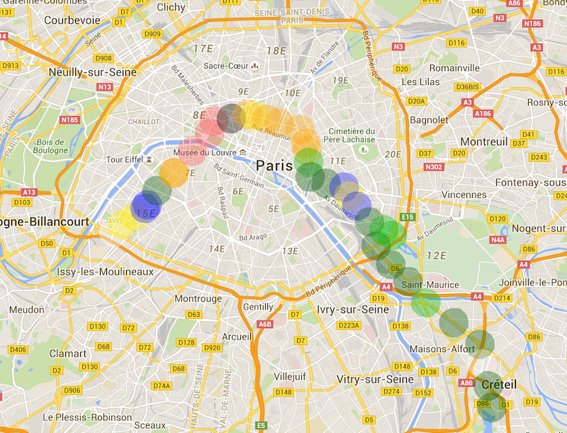

#Mapping Paris' rent prices





##Data

* Use the API from [RentsWatch](http://blog.rentswatch.com/api/)
* Geocoding of the PoI is done by the API


##Install

Prerequisites : 

* [NodeJS](http://nodejs.org)

Dependencies :

* [hapijs](http://npmjs.org/hapijs)
* [chalk](http://npmjs.org/chalk)
* [handlebars](http://npmjs.org/handlebars)
* [inert](http://npmjs.org/inert)
* [request-promise](http://npmjs.org/request-promise)
* [stats-percentile](http://npmjs.org/stats-percentile)
* [vision](http://npmjs.org/vision)


```
	$ npm install
```	
 
##Configure

###API token & endpoint

You need to get your own [RentsWatch](http://rentswatch.com) API token, and set the following env vars :
* API_ENDPOINT
* API_TOKEN


For local tests, you can create a config file as follow :

```
module.exports = {
  API_TOKEN: '{{token}}',
  API_ENDPOINT: 'http://{{api endpoint}}'
};

```

The values will be added to the `process.env`

###Set your own Point of Interests

Update the `poi.js` to map your own point of interests  
Change map's default center & zoom in `static/js/map.js`

##Run

```
	$ npm run
```

##Improve

Feel free to submit any issue or PR :)
